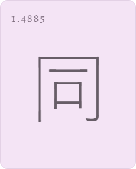

<h1>furoku</h1>

  


## Функция сайта

furoku &mdash; помощник в изучении кандзи. Сайт отсортирует иероглифы в порядке **срочности повторения**. Срочность выясняется с учётом ответов на следующие вопросы:

*Насколько хорошо иероглиф вспоминался раньше?*

*Как давно иероглиф был перед глазами?*

## Сортировка

Встречается два метода сортироки: по частоте и по очкам.

### По частоте 

Применено в общем списке. Частота получена при анализе японской википедии, на основе 100 тыс. статей. Значение сбоку &mdash; сколько раз в среднем иероглиф встречается на странице.



Отсюда иероглифы доступны к добавлению на страницу повторения.

### По очкам

После добавления можно проходить тестирование. В ходе него каждому кандзи причисляются очки, от которых зависит расположение иероглифов на странице повторения и при следующем тестировании.

<details>

<summary>Подробнее о начислении очков</summary>

Очки делятся на основные и дополнительные. Алгоритм их начисления:
1. На сервер отправляется данный при тестировании ответ
2. Определяется, сколько основных и доп. очков положено за такой ответ
3. По следующей формуле начисляются основные очки:

```math
prP + cP + prExP
```

*prP (previous points) - накопленные в прошлом очки<br>
cP (current points) - полученные только что основные<br>
prExP (previous extra points) - доп. очки, накопленные раньше*

4.  Начисляются доп. очки, суммируя текущие и полученные до этого. Они повлияют на следующую оценку кандзи

Таблица изменения основных и дополнительных очков в зависимости от ответа

| Параметр/оценка                |   хорошо        |       средне   |      плохо                |
|:-------------------------------|:---------------:|:--------------:|:-------------------------:|
|основные очки                   | +2              | +1             | -2                        |
|доп. очки                       | +1              | +1             | -1                        |
|**Ограничения**                 |                 |                |                           |
|учёт прошлых доп. очков         |все              |все             |если &#8815; 0             |
|возможные значения доп. очков   |&#8815; 3        |&#8815; 1       |&#8814;-3<br/>&#8815; 0    |
|возможные значения очков в итоге|&#8815; 10       |&#8815; 10      |&#8814; 0                  |

</details>

В общем, основные очки находятся в пределе от 0 до 10, дополнительные &mdash; от -3 до 3.
Смысл доп. очков в учёте самых последних результатов. Поощеряется серия хороших ответов, что показывает устойчивость знания; за серию плохих увеличивается штраф.

Как было сказано, по очкам определяется порядок расположения кандзи, но на их последовательность в тестировании также влияет время последней проверки.
Перед отправкой иероглифов для тестирования их очки корректируются:

```math
p - (dA × tI)
```

*p (points) - очки<br>
dA (days ago) - дней с последней проверки кандзи<br>
tI (time importance) - коэффициент, характеризующий, насколько влияет время. При нынешнем значении (0.5) иероглиф с максимальным количеством очков попадётся в начале тестирования через 20 дней.*

Заученный иероглиф не пропадёт в конце списка тестирования, но с каждым днём будет приближаться к началу. Это &mdash; очередная попытка поддерживать актуальность результатов.

## Виды тестирования

Проверка знания иероглифа мне видится тремя способами:
- С известным написанием проверять знание чтений и значений
- С известными чтениями проверять знание написания и значений
- С известными значениями проверять знание чтений и написания

Всего проще реализовать первый, поэтому пока доступен только он.

## Авторизация

Для возможности сохранять иероглифы понадобиться зарегистрироваться с почтой и паролем. Реализовано это с помощью [NextAuth](https://next-auth.js.org/). Пароли хэшируются [bcrypt](https://github.com/dcodeIO/bcrypt.js).

## Хранение данных

Сохранение информации обеспечивается [couchDB](https://couchdb.apache.org/) с библиотекой [Nano](https://github.com/apache/couchdb-nano).
